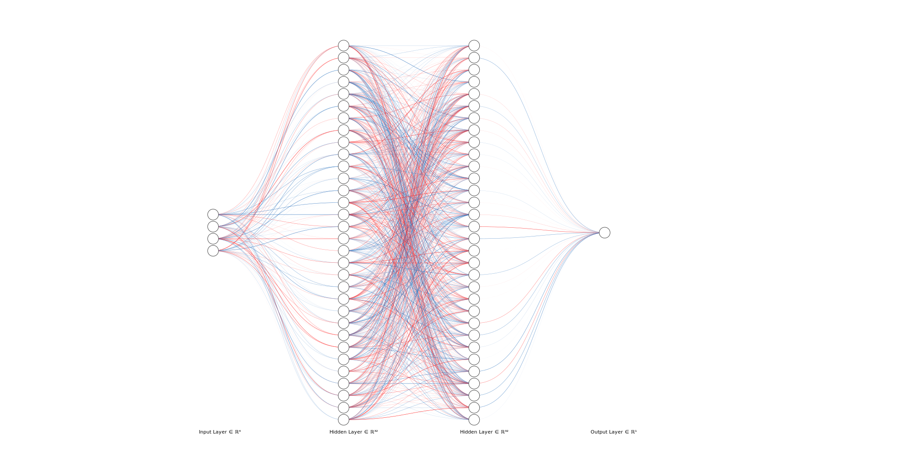

# Tetris AI

*Image sourced from Dall-E v2*

## About

A Deep Q-Network AI model trained to play Tetris. *Unofficially dubbed the TetrisMaster3000.*

https://topey2x.github.io/TetrisAI/

## Installation
1. Clone Github code from [https://github.com/Topey2X/TetrisAI/main](https://github.com/Topey2X/TetrisAI.git)
2. Ensure you have the correct python library requirements using `pip install -r requirements.txt`
> The python version tested and working with this code is `Python 3.11.9`

## Usage
 - To train your own model, run `trainer.py`.
 - To use a model, run `tester.py`.

## Environment

The tetris environment is tracked using numpy arrays to handle the pieces and the game board state, and rendered using OpenCV to generate and display each frame.

### Observation Space

The observation space contains observations about the game board *after* a piece has been placed in a specific position.

- The number of holes in the board
- The height of the heighest column
- The number of rows cleared in this step
- The 'bumpiness' of the board: i.e. the sum of all column pairs' height differences (A → B, B → C, etc.)

### Action Space

- An arbitrary score reflecting how good the AI thinks the game state outcome is.

## Model Parameters 

### Network Architecture

### Batch Size

Uses a batch size of 512. This is to provide more data for stable weight updates, as well as a better representation of training data.

## Rewards

To encourage the model to clear lines effectively, the following rewards were chosen:

- **Reward Step** = +1 for every step.
- **Reward Clears** = Reward lines cleared this step. Reward = `lines_cleared²`
- **Penalise Game End** = -20 for the game ending.

## Evaluation Metrics

- Steps (longer game is better)
- Score (higher score is better)
